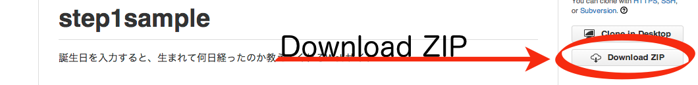
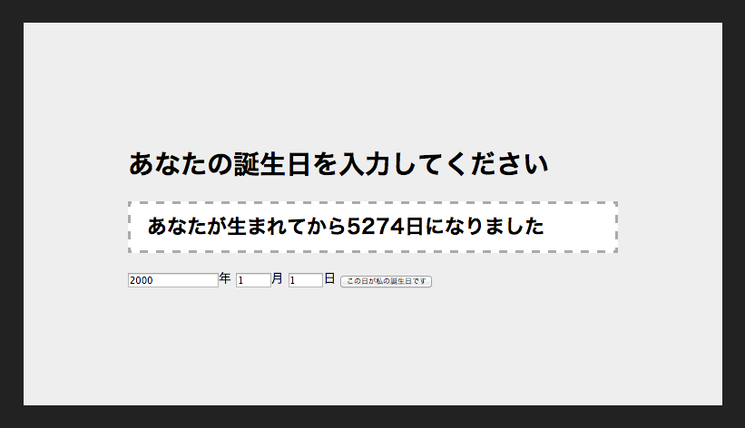

# STEP1-1.サンプルコードを動かしてみる

Webサイトを作るためにHTML,JavaScript,CSSという3種類の[ソースコード](http://ja.wikipedia.org/wiki/%E3%82%BD%E3%83%BC%E3%82%B9%E3%82%B3%E3%83%BC%E3%83%89)を書いてみます。
HTMLでWebサイトを記述し、CSSで装飾、JavaScriptをつかってWebサイト上でプログラムを動かします。
この３種類のソースコードについて既に書かれたサンプルコードを触りながら説明します。
JavaScriptについてはSTEP1-3、HTMLとCSSについてはSTEP1-4で後ほど詳しく説明します。

### サンプルコードを動かす
サンプルコードは[step1sample](https://github.com/farundorL/step1sample)にアクセスして、右下にあるDownloadZIPをクリックしてダウンロードしてください。

保存したファイルを解凍すると、中には4つのファイルがあるはずです。
<table>
<tr><td>README.md</td>  <td>サンプルコードの説明が書かれているテキストファイル</td></tr>
<tr><td>birthday.js</td><td>JavaScriptファイル</td></tr>
<tr><td>default.css</td><td>CSSファイル</td></tr>
<tr><td>index.html</td> <td>HTMLファイル</td></tr>
</table>

index.htmlを開くとサンプルのWebサイトが表示されます。
このWebサイトは誕生日を入力すると生まれてから経過した日数を教えてくれるサイトです。


### サンプルコードを編集する
ダウンロードしたファイルを編集してオリジナルのWebサイトを作ってみましょう。
メモ帳などのエディタによりファイルを開き、編集します。

#### HTMLの書き換え
index.htmlを開き、8行目にある

```html
<h1>あなたの誕生日を入力してください</h1>
```
という日本語で書かれたテキストを

```html
<h1>あなたの誕生日はいつですか？</h1>
```
という風に書き換え、保存します。
そしてWebブラウザを更新するかもう一度index.htmlを開くと、表示される言葉が変わっていることがわかります。
HTMLを用いてこのようにWebサイトに表示する言葉や画像、リンクなどの要素を記述します。

#### CSSの書き換え
default.cssを開き、2行目にある

```css
background-color: #222;
```
の数字の部分を

```css
background-color: #822;
```
という風に書き換えます。
ここはWebページの背景色を設定する部分になっています。
そしてまたWebブラウザで確認すると黒色だった背景が赤色に変わっていることがわかります。
CSSを用いて表示される要素の大きさや色を記述し、Webサイトの装飾を行います。

#### JavaScriptの書き換え
birthday.jsを開き、29行目にある

```js
var message = "あなたが生まれてから" + diff.days + "日になりました";
```
の部分がボタンが押されたときに表示する言葉を設定しています。
ここの日本語を変更するとボタンを押した時に表示される言葉が変わっていることがわかります。
なにも表示されなければ間違ったプログラムになっています。
JavaScriptを用いてWebサイトでメッセージを出したり画面を動かすプログラムを記述します。

HTML,JavaScript,CSSを書き換えることで、誕生日までの日をカウントダウンするWebサイトや誕生日占いサイトを作ることもできます。
