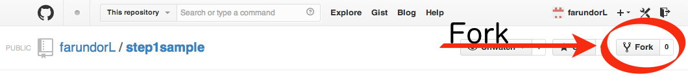
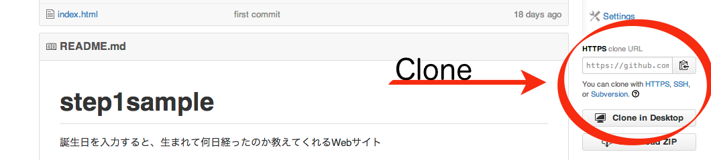

# STEP1-2.Gitを使ってみる

STEP1-1でサンプルコードを動かしてみました。
サンプルコードやこのWebサイトの管理をするため[GitHub](https://github.com/)というソフトウェア開発のための共有サービスを使っています。
GitHubではGitというバージョン管理システムを用います。
今回はGitを使ってサンプルコードの管理をします。
GitHubを用いて進めるので最初に[アカウントを作成](https://github.com/join)してください。

### Gitについて
[Git](http://git-scm.com/book/ja)を使うことでファイルの編集を履歴として保存することができ、プログラムの変更を確認したり復活させたりすることができます。
また複数人で1つのプログラムを編集して開発する際にもよく使われています。

まずはパソコンでGitを使えるようにするためGitクライアントをインストールします。
Gitクライアントとして[Git for Windows](http://msysgit.github.io/)を対象に進めます、インストールしてください。
他にも[GitHub Windows](https://windows.github.com/)や[SourceTree](http://www.sourcetreeapp.com/)といったクライアントもあります。
どのクライアントも同じGitの作業はできます。

### サンプルコードを複製する
Github上に用意したサンプルコードからバージョン管理をはじめてみます。
サンプルコード[step1sample](https://github.com/farundorL/step1sample)にアクセスして右上にあるForkをクリックします。

Fork（フォーク）とは、人のプログラムを編集したいときに自分のところへコピーを行うことです。

そしてForkしたサンプルコードをGithubから自分のパソコンに複製（clone）します。

GithubのForkしたページにある「clone URL」をコピーしてパソコン上に複製します。

TODO: GitForWindowsでCloneするスクショ追加

複製するとディレクトリが保存され、中には4つのファイルがあるはずです。

このディレクトリ中にある「index.html」というファイルを開くとSTEP1-1と同じようにサンプルのWebサイトが表示されます。
STEP1-1と同じようにソースコードを編集してみてください

#### バージョン管理
編集してからここでGitクライアントを使って、状態（status）や差分（diff）を確認してみてください。
編集した3つのファイルがパソコン上で変更された（modified）という状態が表示されるはずです。
また3つのファイルでそれぞれどの行が変更されたか差分も確認することができます。

TODO: GitForWindowsでStatusとDiffを表示するするスクショ追加

今回行った変更をGitに保存します。
変更を行ったファイルを選択、追加（add）して変更内容を記録（commit）します。

TODO: GitForWindowsでAddとCommitするスクショ追加

記録してから状態（status）を確認すると、先ほど変更したと表示していたファイルが表示されなくなっているはずです。
記録内容はログ（log）で確認できます。
最後に、自分のパソコン内での記録をGithubに反映（push）することもできます。

TODO: GitForWindowsでLogの表示とPushするスクショ追加

Gitの基礎から学ぶことのできる[入門サイト](http://www.backlog.jp/git-guide/)やGitのコマンドを説明してくれる[チュートリアル](https://www.atlassian.com/ja/git/tutorial)などが公開されています。
また実際に動かしてイメージを掴む[LearnGitBranching](http://k.swd.cc/learnGitBranching-ja/)というWebサイトもあります。
詳しくは[GitBook](http://git-scm.com/book/ja)を見ると参考になると思います。
